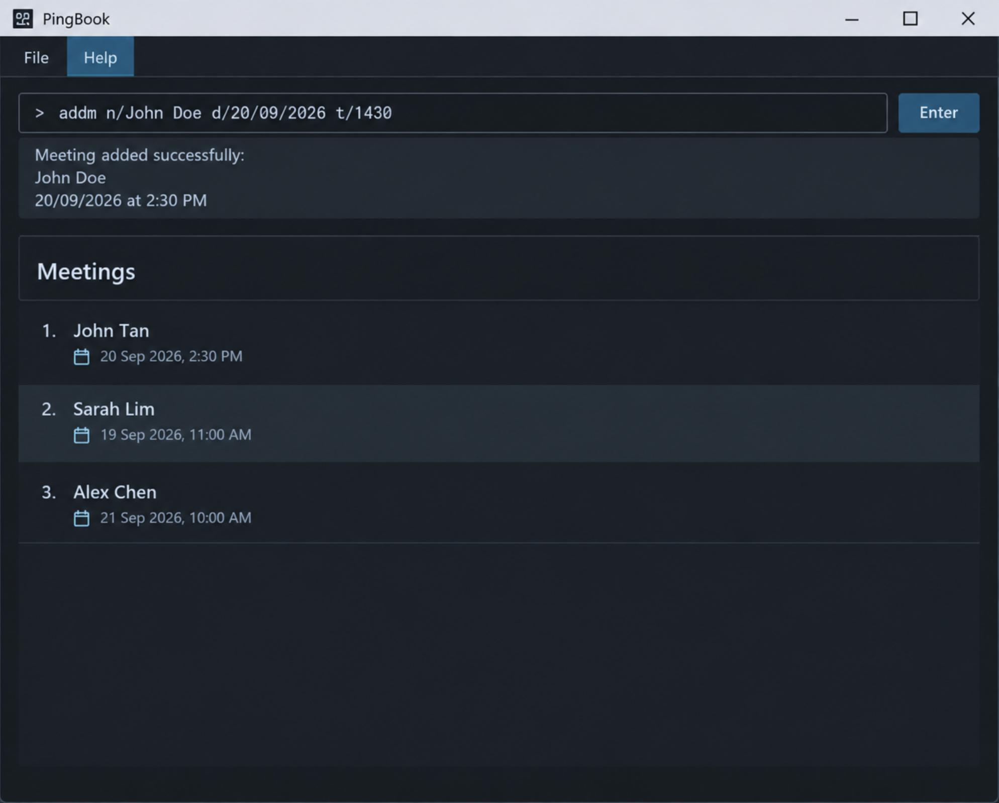

# PingBook

**PingBook is a desktop app for secretaries and sales representatives to manage their clients and meetings in one place.**
It is optimised for use via a Command Line Interface (CLI), while still having the benefits of a Graphical User Interface (GUI).

Secretaries juggle many contacts at once, and those contacts are often scattered across spreadsheets, notebooks and memory.
PingBook gives them a fast, reliable place to find the right client in seconds and keep track of who they are meeting and when.

## Target user

PingBook is designed for secretaries and sales representatives who:

* support several managers or clients and keep adjusting schedules throughout the day
* need to look up client contact details quickly
* are comfortable typing short commands and prefer that to clicking through menus

## Features

The first version of PingBook will support:

| Feature        | Command                                                   |
|----------------|-----------------------------------------------------------|
| Add a client   | `addc n/NAME p/PHONE_NUMBER e/EMAIL [a/ADDRESS] [t/TAG]...` |
| Delete a client | `deletec CLIENT_INDEX`                                   |
| List clients   | `listc`                                                   |
| Add a meeting  | `addm n/NAME d/DATE st/START_TIME et/END_TIME`            |
| Delete a meeting | `deletem MEETING_INDEX`                                 |
| List meetings  | `listm`                                                   |

Features being considered for later versions include:

* tagging, pinning and searching for clients
* editing client details and storing multiple phone numbers and emails per client
* warnings when meetings clash
* recurring meetings
* finding free time slots and viewing the schedule for a given day
* recording meeting outcomes and viewing a client's meeting history

## Documentation

* [User Guide](https://ay2627s1-cs2103t-w13-4.github.io/tp/UserGuide.html)
* [Developer Guide](https://ay2627s1-cs2103t-w13-4.github.io/tp/DeveloperGuide.html)
* [About Us](https://ay2627s1-cs2103t-w13-4.github.io/tp/AboutUs.html)

## Acknowledgements

This project is based on the AddressBook-Level3 project created by the [SE-EDU initiative](https://se-education.org).
