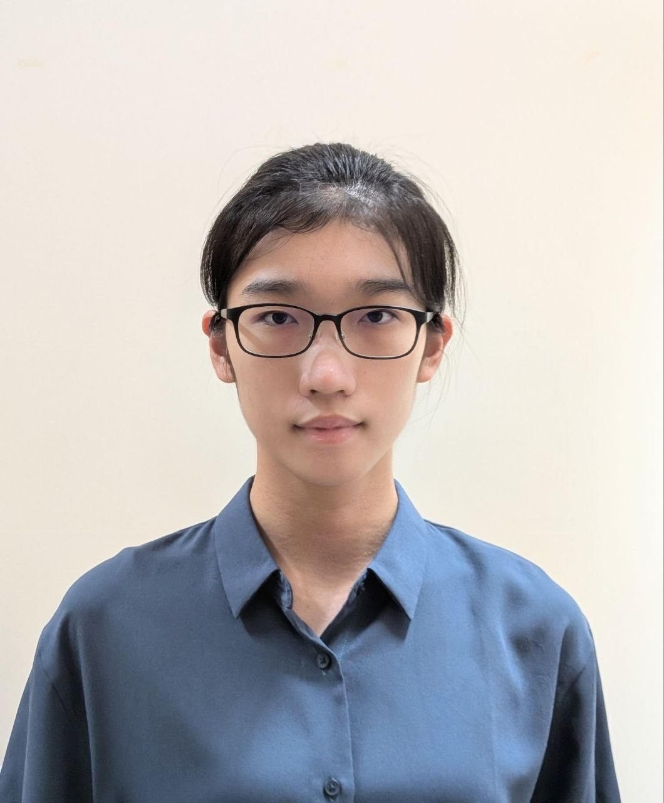
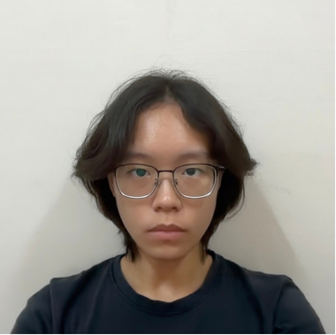
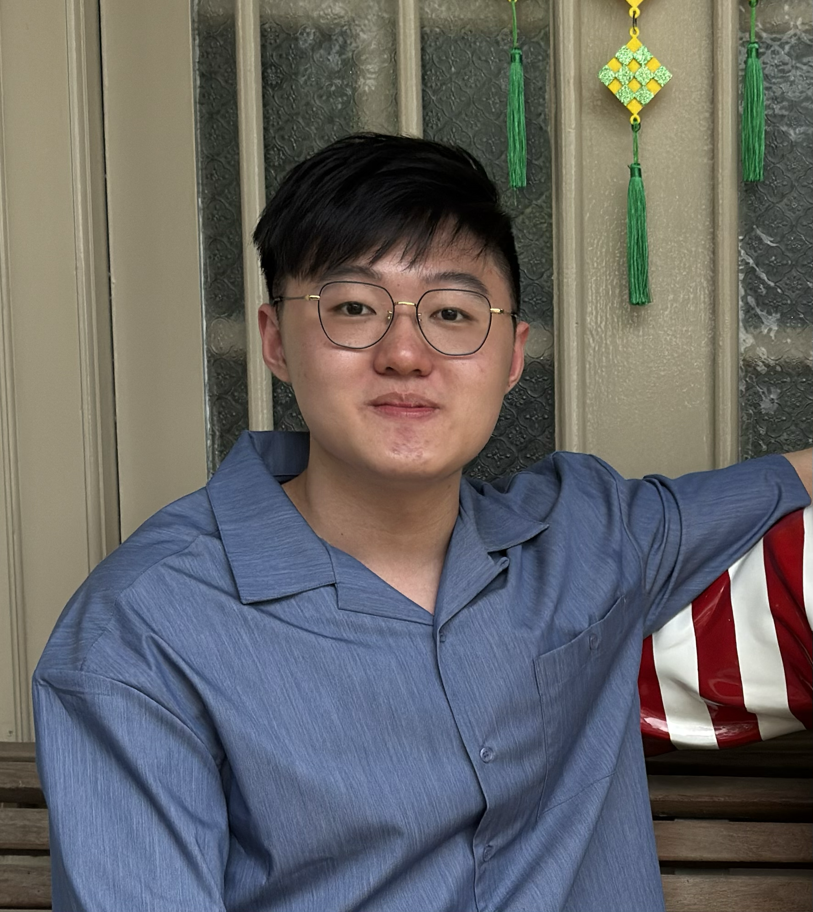

# About Us

We are a team based in the [School of Computing, National University of Singapore](http://www.comp.nus.edu.sg).

You can reach us at the email `e1526255[at]comp.nus.edu.sg`

## Project team

### Ko Ping-Yun

[[github](https://github.com/bibikowlf)]

* Role: Developer
* Responsibilities: Deliverables, Logic

### Jane Doe

[[github](http://github.com/johndoe)]
[[portfolio](team/johndoe.md)]

* Role: Team Lead
* Responsibilities: UI

### Johnny Doe

[[github](http://github.com/johndoe)] [[portfolio](team/johndoe.md)]

* Role: Developer
* Responsibilities: Documentation, Storage

### Tan Kai Han

[[github](http://github.com/kaih4n)]

* Role: Developer
* Responsibilities: Integration, UI

### Chester Lee

[[github](http://github.com/ChesterLZW)]

* Role: Developer
* Responsibilities: Code Quality, Model
